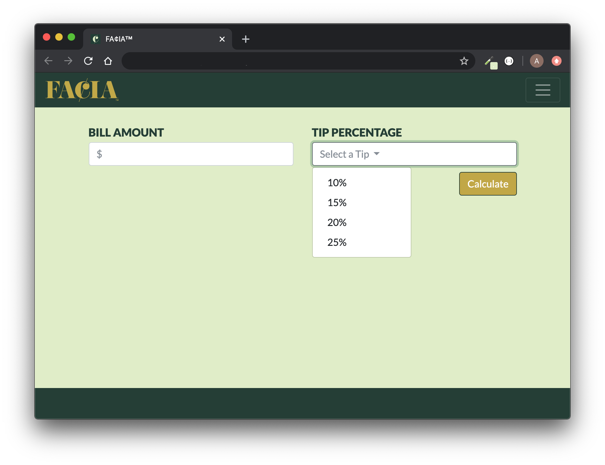
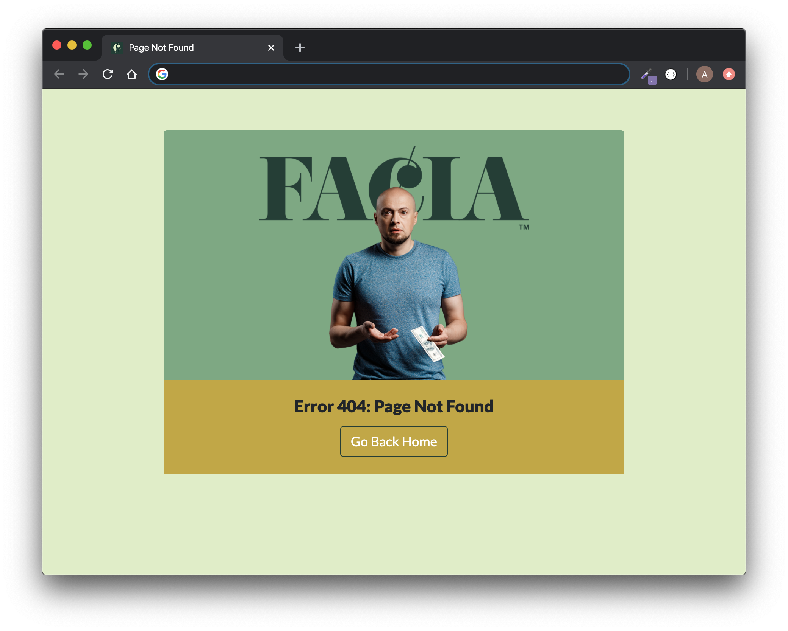

# UTA-VIRT-FSF-PT-01-2020-U-LOL Project #2


Felipe, Ashley, Catherine, Ian, Amit

[FACIA App on Heroku](https://pr0ject-2.herokuapp.com/)

[FACIA Git Repo](https://github.com/zibrahim2046/Project2)

# Budgeting


</br></br>


## Instructions

* Only one member of each group should complete this activity while the others watch.

* Copy the entire [Unsolved](Unsolved) folder to another location on your computers &mdash; wherever you would like your local copy of the group project to be.

* Rename the copied "Unsolved" folder to the name of your project.

* Open the copied project folder's `package.json` file and change its `name` property to the name of your project.

* CD to the root of the copied project folder with your terminal and run the following commands:

  ```
  git init
  git add .
  git commit -m "Initial commit"
  ```

* Then copy the GitHub repo's remote SSH URL (the same URL you'd use to clone the repo).

* Run the following commands in your terminal, replacing <remote-url> with your GitHub repo's remote SSH URL.

  ```
  git remote add origin <remote-url>
  git push origin master
  ```

* If completed successfully you should see all of the files uploaded to GitHub.

* All other group members should now clone the repo.

* Discuss as a group:

  * How would you now add changes to this project?

</br></br>

# Tip Calculator

</br></br>

# Error: 404 Page Not Found
When the user tries to access an invalid URL, we display a 404 page.

</br></br>

### This Project:
* Utilizes a Node and Express Web Server
* Is backed by a MySQL Database with a Sequelize ORM
* Uses both GET and POST routes for retrieving and adding new data
* Is deployed using Heroku (with Data)
* Incorporates **at least one new library, package, or technology that we haven’t discussed**
* Has a polished frontend/UI
* Is organized by a folder structure that meets MVC Paradigm
* Meets good quality coding standards (indentation, scoping, naming)