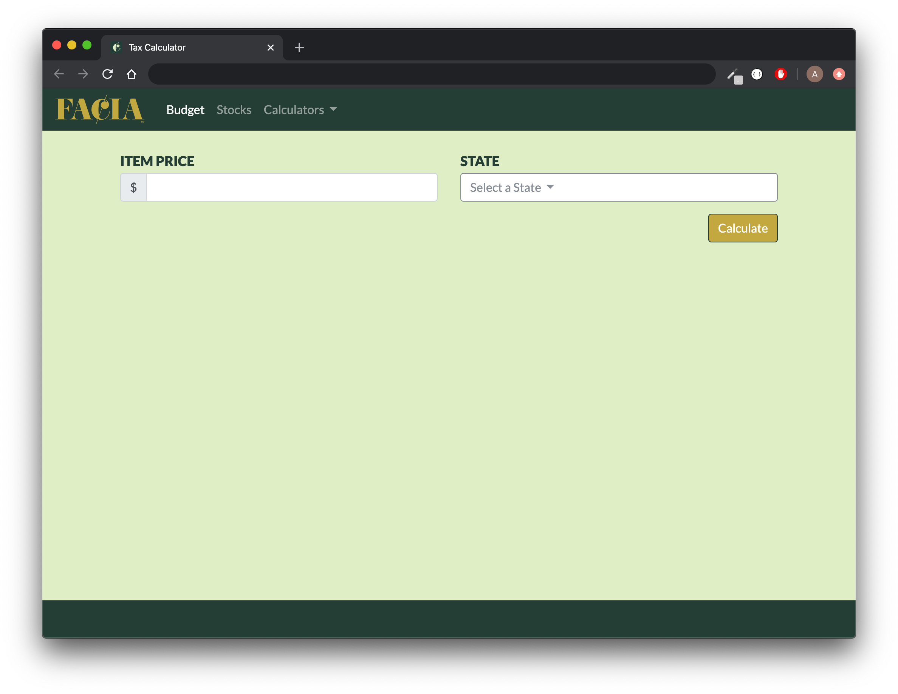
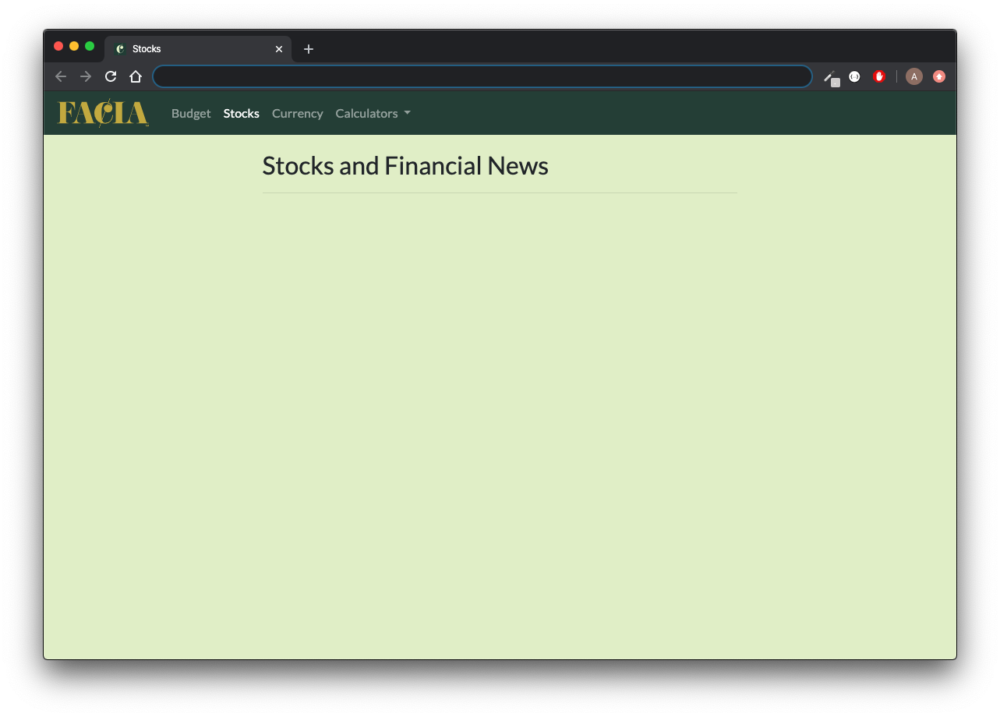
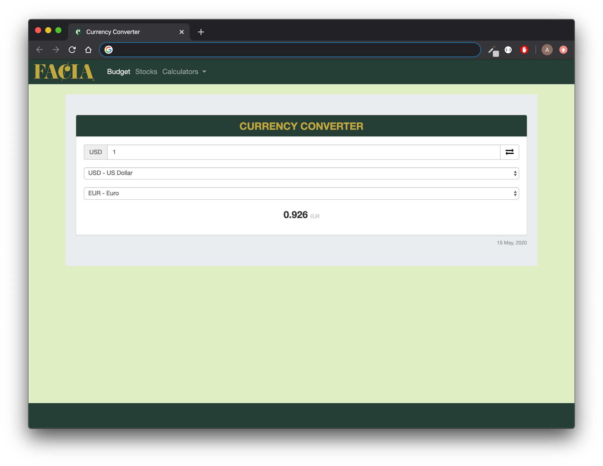

# UTA-VIRT-FSF-PT-01-2020-U-LOL Project #2

Felipe, Ashley, Catherine, Ian, Amit

[FACIA App on Heroku](https://pr0ject-2.herokuapp.com/)   |   [FACIA Git Repo](https://github.com/zibrahim2046/Project2)

[Presentation](https://docs.google.com/presentation/d/11XIXUa12HQBzGGCEjEBGNB6v8zZXg0ODZb5UhqJjr0M/edit#slide=id.p1)

 

# Main Budgeting Function
Budgeting page takes in expenses, saves them to the database, and calculates remaining budget.

  

# Tip Calculator
Tip Calculator calculates total bill amount from bill amount and desired tip percentage.

  

# Tax Calculator
Tax Calculator calculates total price from item price and tax rate by state.

  

# Stocks
Stocks page returns current financial news from https://finnhub.io/docs/api API.

  

# Currency Converter
Currency Converter uses a widget from https://currencyrate.today/ to convert entered amounts.

Resource:

  

# Error: 404 Page Not Found
When the user tries to access an invalid URL, we display a 404 page.

  

### This Project:
* Utilizes a Node and Express Web Server
* Is backed by a MySQL Database with a Sequelize ORM
* Uses both GET and POST routes for retrieving and adding new data
* Is deployed using Heroku (with Data)
* Incorporates widget
* Has a polished frontend/UI
* Is organized by a folder structure that meets MVC Paradigm
* Meets good quality coding standards (indentation, scoping, naming)